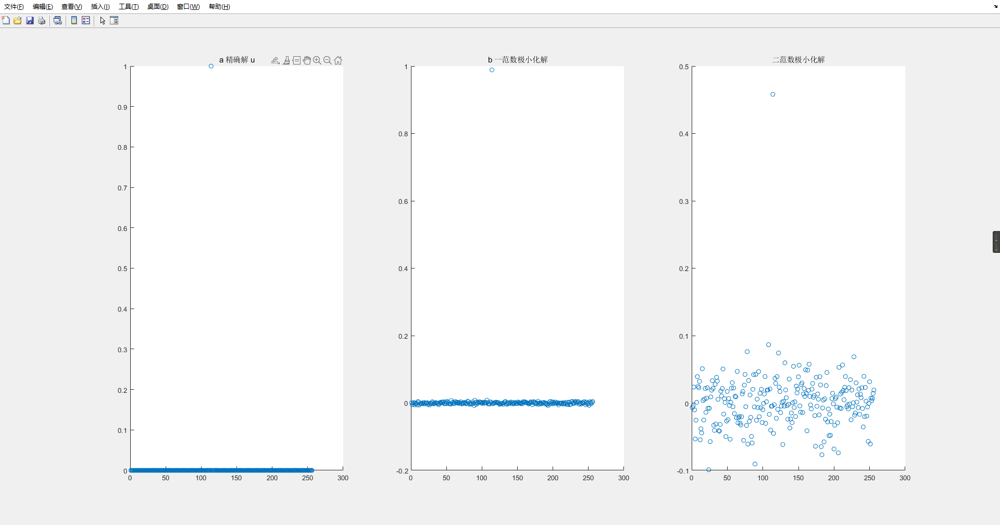
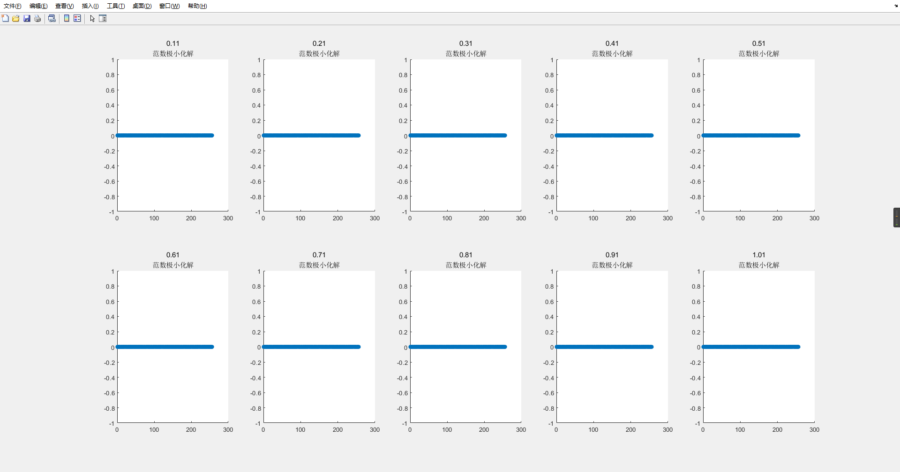
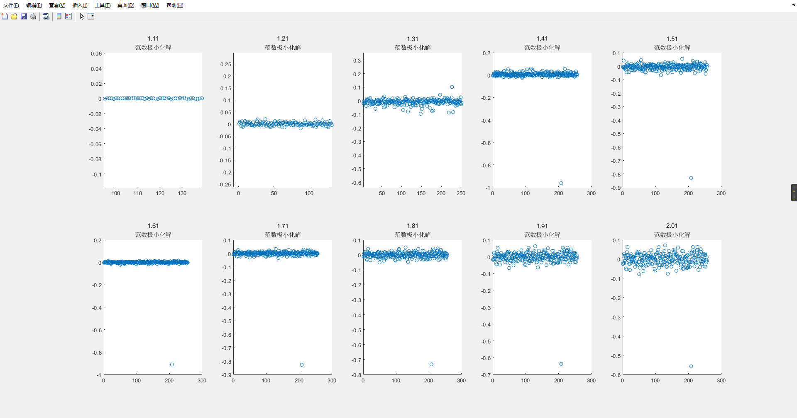

### 代码运行截图




# 1.1 

使用MATLAB作图如下所示：

可发现当$p \in (0,1]$时，解该优化问题的解比较稳定，可能具备稀疏性，而当$p\in(1,2)$时，可发现解的不稳定性逐渐变大，不具备稀疏性。





1-2步长如图所示




### 程序代码

```matlab
m = 128; n = 256;
A = randn(m,n);

u = sprandn(n,1,0,1);
b = A*u;
% solve 
x0 = zeros(n,1);
x_original = 0.01; x_now = x_original;
step = 0.1;
i =1;
while x_now <= 1
    x0 = zeros(n,1);
    func = @(x) norm(x,x_now);
    x_para_now = fmincon(func,x0,[],[],A,b);
    subplot(2,5,i);
    scatter(1:n,x_para_now);

    i = i +1;
    x_now = x_now +step;
    title(x_now,'范数极小化解')

end
i=1;
while x_now <= 2
    x0 = zeros(n,1);
    func = @(x) norm(x,x_now);
    x_para_now = fmincon(func,x0,[],[],A,b);
    subplot(2,5,i);
    scatter(1:n,x_para_now);

    i = i +1;
    x_now = x_now +step;
    title(x_now,'范数极小化解')

end
```

